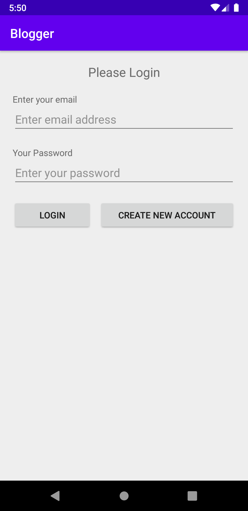
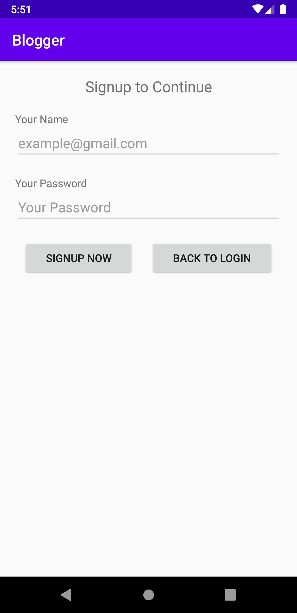
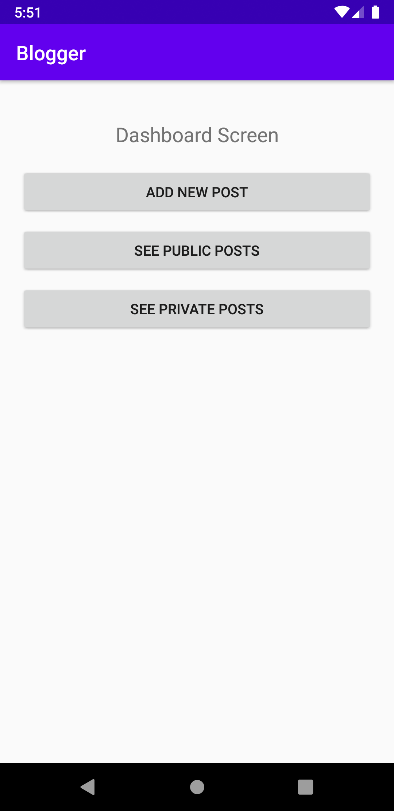

# Blogger Android Client

The application was a educational project developed to improve coding skills. The overall goal of the project was to practice _Java_ language concepts.

## Project Assets

```txt
+ diagrams/ ==> Contains all the diagram files related to project, includes mockup etc.
+ screenshots/ ==> Contains application screenshots.
+ ... / Rest of the project itself.
```

## Screenshots

<div style="display: flex; flex-direction: row; margin-bottom: 20px;">

<div style="display: flex; flex: 0.5; margin: 10px;">
    
</div>

<div style="display: flex; flex: 0.5; margin: 10px;">
    
</div>

</div>

<div style="display: flex; flex-direction: row;">

<div style="display: flex; flex: 0.5; margin: 10px;">
    
</div>

<div style="display: flex; flex: 0.5; margin: 10px;">
    
</div>

</div>
